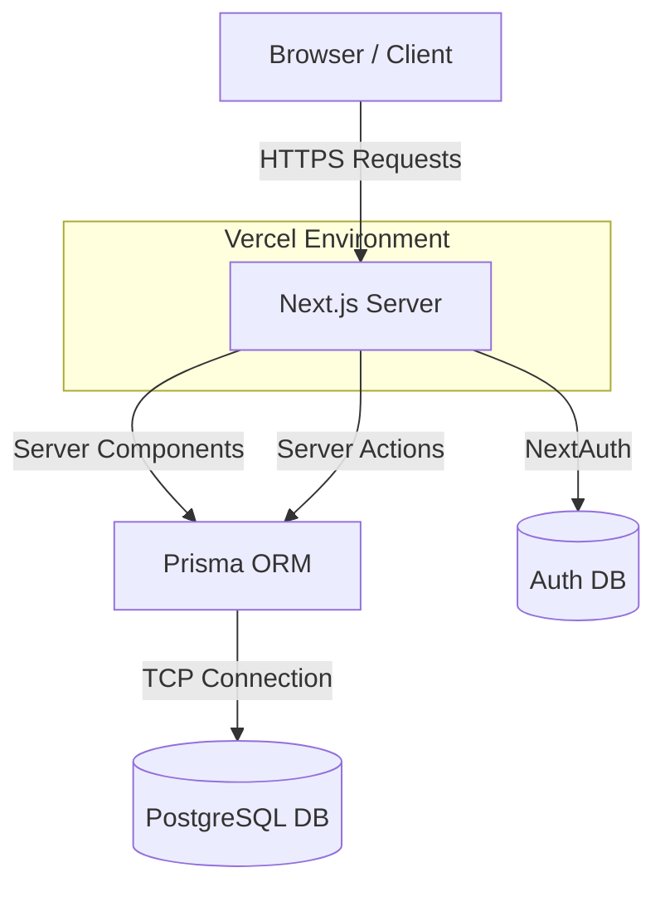
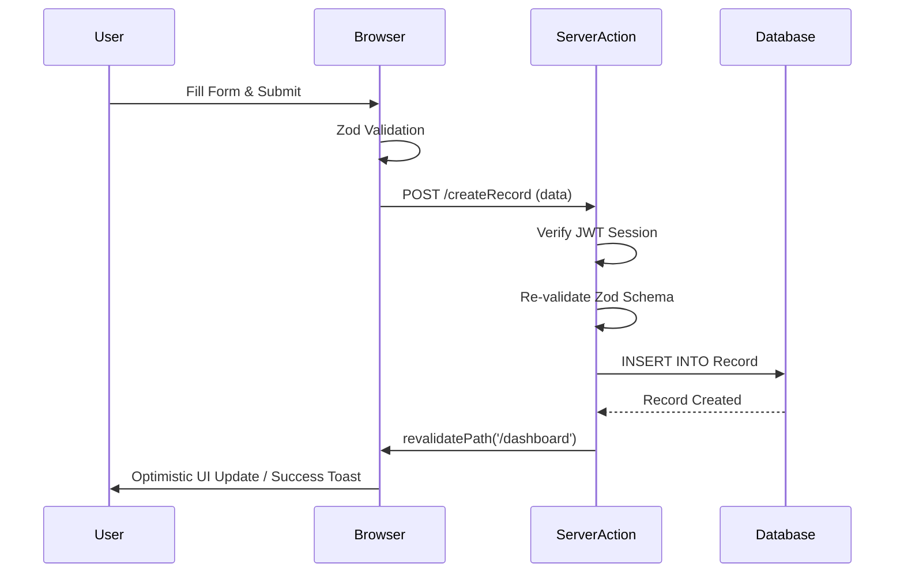
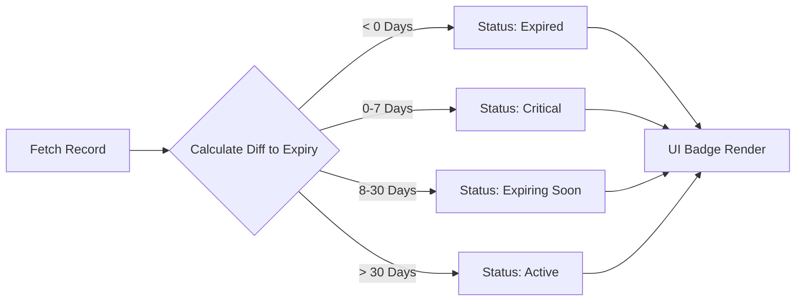

# ExpiryAlert: Comprehensive Architectural & Technical Documentation

This document serves as a complete, deep-dive software engineering analysis of the **ExpiryAlert** platform. It outlines the architectural decisions, database schema design, feature-by-feature implementation details, security considerations, and the overarching business logic that drives the application. 

This documentation is designed for software engineers, product managers, technical recruiters, and system architects who want to understand exactly how ExpiryAlert is constructed under the hood.

---

## 1. PROJECT OVERVIEW

### The Problem Space
In enterprise environments, managing the lifecycle of mission-critical documents—such as SLA contracts, compliance certifications, software licenses, fire safety audits, and insurance policies—is heavily reliant on manual tracking, usually through static Excel spreadsheets. This manual process is highly prone to human error, leading to missed deadlines, regulatory fines, operational bottlenecks, and financial liabilities. 

### Target Users
ExpiryAlert targets:
- **Compliance Officers**: Ensuring regulatory certificates remain valid.
- **IT Managers**: Tracking software licensing and SSL certificates.
- **Facility Managers**: Monitoring machine inspections and lease agreements.
- **HR Departments**: Managing employee certifications and visas.
- **Procurement Teams**: Handling vendor SLAs and NDAs.

### Real-World Use Cases
- A hospital tracking doctor medical licenses to ensure continuous compliance.
- A manufacturing plant monitoring the expiry of heavy machinery safety audits to prevent industrial accidents.
- A tech startup managing the lifecycle of AWS enterprise support contracts and domain names.

### Design Philosophy
The architectural philosophy of ExpiryAlert is **"Proactive, Not Reactive."** 
Instead of users seeking out expiring documents, the system pushes critical alerts to the user. The platform is designed to be highly reliable, instantly responsive (optimistic UI), and scalable for multi-tenant SaaS environments.

### Technical & Business Goals
- **Technical Goals**: Achieve a sub-second Time to Interactive (TTI), ensure zero-latency data mutations via React Server Actions, guarantee absolute type-safety from database to client, and maintain strict multi-tenant data isolation.
- **Business Goals**: Reduce compliance breaches by 99%, automate document lifecycles, and provide a low-friction onboarding experience for enterprise teams.

---

## 2. COMPLETE APPLICATION FLOW

The lifecycle of a user interaction within ExpiryAlert follows a strict, secure path.

### 1. Landing Page & Onboarding
The user lands on the marketing page, built statically using Next.js Server Components for maximum SEO and speed. Upon clicking "Start for Free," they are routed to the authentication layer.

### 2. Authentication (NextAuth.js)
The user submits registration credentials. The Next.js API route hashes the password via `bcrypt` and creates a dual-entity: a `User` and their isolated `Organization`. A secure JWT session token is encrypted and stored in an HTTP-only cookie.

### 3. Dashboard Initialization
Upon login, the user is redirected to the `/dashboard`. Next.js intercepts the request, verifies the JWT, and extracts the `organizationId`. A server-side Prisma query fetches aggregate data (total records, expiring soon, active). The server renders the initial HTML payload, guaranteeing fast LCP (Largest Contentful Paint).

### 4. Create Record (Data Mutation)
The user opens the "Create Record" form.
- **Client**: Zod validates the input (dates, strings, file sizes).
- **Network**: A Server Action is invoked via a `POST` request.
- **Server**: The action re-validates the session, verifies the `organizationId`, processes any file uploads, and inserts the `Record` into the PostgreSQL database.
- **Response**: The server calls `revalidatePath('/dashboard')`, instructing Next.js to purge the router cache and stream the fresh data back to the client.

### 5. Notification Engine
Whenever a user logs in or a background cron job runs, the Expiry Status Engine evaluates all records. If a record transitions from `Active` to `Expiring Soon` (e.g., < 30 days), a `Notification` entity is inserted into the database and pushed to the user's UI.

### 6. Renewal Workflow
When a document expires, the user uploads a new version and sets a new date. The system doesn't just overwrite the old date; it archives the previous state into a `RenewalHistory` table, ensuring a complete audit trail.

---

## 3. COMPLETE FEATURE BREAKDOWN

### Authentication & Session Management
- **Purpose**: Secure access and tenant isolation.
- **Frontend Flow**: Client submits email/password. NextAuth `signIn('credentials')` is called.
- **Backend Flow**: NextAuth authorizes against the database using `bcrypt.compare`.
- **Business Logic**: Every user is strictly bound to an `Organization`. Without an `organizationId`, the system throws an `Unauthorized` error at the data-access layer.

### Record Management (CRUD)
- **Purpose**: The core engine for document lifecycle tracking.
- **Frontend Flow**: The user interacts with the `DataTable` (TanStack Table). Clicking delete triggers an optimistic UI update, hiding the row instantly.
- **Backend Flow**: A Server Action (`deleteRecords`) is invoked. It verifies ownership, executes a Prisma `deleteMany`, and triggers `revalidatePath`.
- **Database Operations**: Foreign key cascades ensure attachments and history are purged if a record is hard-deleted.
- **Edge Cases**: If a user attempts to delete a record belonging to another tenant via API spoofing, the Prisma `where: { id, organizationId }` clause silently ignores the request.

### Expiry Status Engine
- **Purpose**: Calculates the real-time health of a document.
- **How it works internally**: Status is *not* persisted in the database as a static string. Because time constantly moves forward, a status of `Active` today might be `Critical` tomorrow without any user interaction. Therefore, status is derived dynamically upon fetching:
  ```typescript
  // Pseudo-code for dynamic status calculation
  function calculateStatus(expiryDate: Date, now: Date): Status {
    const daysLeft = diffInDays(expiryDate, now);
    if (daysLeft < 0) return 'Expired';
    if (daysLeft <= 7) return 'Critical';
    if (daysLeft <= 30) return 'Expiring Soon';
    return 'Active';
  }
  ```

### Dashboard Analytics & Charts
- **Purpose**: High-level executive overview.
- **Frontend Flow**: Recharts consumes aggregated data to render pie charts and bar charts.
- **Backend Flow**: Prisma performs a `.groupBy` operation on records to calculate category distributions, drastically reducing the JSON payload sent to the client compared to fetching all records and filtering in JavaScript.

---

## 4. DETAILED THOUGHT PROCESS & ARCHITECTURAL DECISIONS

### Why dynamic expiry calculation?
As mentioned, storing `status = "Active"` in a SQL row is an anti-pattern for time-series states. If a document expires at midnight, no database trigger or cron job should be required to update a string field. By calculating status dynamically in the application layer during the database read (`SELECT`), the system is infinitely scalable and immune to timezone discrepancies or failed cron jobs.

### Why Server Actions over REST APIs?
Traditional REST APIs require `fetch`, `useEffect`, loading states, and state synchronization. By utilizing React Server Actions, ExpiryAlert executes secure RPC (Remote Procedure Calls) directly from client components. This eliminates client-side API boilerplate, inherently provides strict type safety between the frontend form and backend database, and automatically handles cache invalidation (`revalidatePath`).

### Why Optimistic UI for Deletions?
When dealing with enterprise tables containing hundreds of records, waiting 500ms for a network roundtrip to hide a deleted row feels sluggish. ExpiryAlert utilizes React state and custom DOM events to instantly remove the row from the DOM (`handleOptimisticDelete`), while the Server Action resolves in the background.

---

## 5. DATABASE THOUGHT PROCESS

The PostgreSQL database is heavily normalized to ensure data integrity and query efficiency.

| Table | Purpose | Relationships | Why it exists |
|---|---|---|---|
| **User** | Authentication & identity. | Belongs to `Organization`. Has many `Notifications`. | To manage sessions and user-specific preferences. |
| **Organization** | Tenant boundary for multi-tenancy. | Has many `Users`, `Records`, `Categories`. | Ensures absolute data isolation. User A cannot see User B's records. |
| **Record** | The core document tracking entity. | Belongs to `Organization`. Has many `Attachments`. | Stores metadata, dates, and priorities. |
| **Attachment** | File metadata. | Belongs to `Record`. | Separates file logic from record logic (1:N relationship allows multiple files per record). |
| **RenewalHistory**| Audit trailing. | Belongs to `Record`. | Enterprise compliance requires tracking *when* and *how* a document was renewed in the past. |
| **Notification** | Alerting system. | Belongs to `User` & `Record`. | Allows users to track acknowledged vs unacknowledged alerts. |

### Indexes & Scalability
- **Composite Indexes**: Indexes are placed on `[organizationId, id]` to dramatically speed up tenant-scoped point lookups.
- **Date Indexes**: An index on `expiryDate` accelerates the continuous scanning required to generate dashboard metrics and notifications.

---

## 6. APPLICATION ARCHITECTURE

ExpiryAlert is a full-stack Next.js application leveraging the App Router.

- **Rendering Strategy**: The dashboard utilizes **Hybrid Rendering**. The outer shell (Sidebar, Navbar, main data table) is rendered on the server (SSR/RSC) to ensure zero layout shift and fast LCP. Interactive islands (Dropdowns, Modals, Forms) are designated as Client Components (`"use client"`).
- **State Management**: Complex global state managers (like Redux) were intentionally avoided. Server state is managed by Next.js router cache, while local UI state is managed via React `useState` and native DOM Events for cross-component communication (e.g., updating the notification badge).
- **Data Fetching**: Data is fetched directly inside Server Components using Prisma, bypassing the network overhead of standard API calls.

---

## 7. PAGE BY PAGE BREAKDOWN

1. **Landing Page (`/`)**: Static generation. Optimized for marketing, hero animations, and feature showcases.
2. **Dashboard (`/dashboard`)**: The nerve center. Server-fetches aggregate counts, maps them to KPI cards, and processes the upcoming deadlines widget.
3. **Records (`/dashboard/records`)**: A heavy data-grid page. Implements TanStack table for client-side sorting/filtering of server-provided data arrays.
4. **Create/Edit Record**: Form pages utilizing React Hook Form + Zod. Ensures no malformed data ever reaches the database.
5. **Notifications (`/dashboard/notifications`)**: A dedicated inbox for alerts, syncing seamlessly with the navbar popover.
6. **Settings (`/dashboard/settings`)**: Profile and organization configuration.

---

## 8. COMPONENT BREAKDOWN

- **`DataTable`**: A highly reusable wrapper around `@tanstack/react-table`. It abstracts away pagination logic, row selection, and filtering so it can be reused for Records, Users, or Logs.
- **`RowActions`**: The dropdown menu at the end of each table row. It encapsulates the complex logic of mutation (Edit, Delete, Renew) without bloating the table component itself.
- **`NotificationPopover`**: A polling/event-driven client component that sits in the navbar, providing global access to alerts regardless of the current route.
- **`StatCards`**: Pure UI components designed to accept raw numbers and render them beautifully with Lucide icons and trend indicators.

---

## 9. USER JOURNEY

1. **Onboarding**: A facility manager signs up for ExpiryAlert. The system automatically provisions their isolated `Organization`.
2. **Initial Population**: The user navigates to "Records" and uploads 10 fire safety certificates, setting varying expiry dates.
3. **Passive Monitoring**: The user closes the app.
4. **Alert Trigger**: Two months later, a certificate enters the 30-day "Expiring Soon" window.
5. **Action**: The user logs in, sees a red badge on the notification bell, clicks it, and is taken directly to the specific certificate.
6. **Resolution**: They conduct a new fire audit, upload the new certificate to the system, and click "Renew". The old certificate is archived in `RenewalHistory`, and the new expiry date is set for next year.

---

## 10. BUSINESS LOGIC

### Priority Matrix
Priority is decoupled from Expiry Status. A document can be `Low` priority but `Critical` status (expired), or `Critical` priority but `Active` status. This allows organizations to filter for "Critical Priority + Expiring Soon" to allocate immediate capital and resources.

### Notification Generation
Notifications are generated idempotently. The system checks if a notification for a specific record state (e.g., 30-day warning) already exists for a user. If it does, it skips generation to prevent spamming the inbox.

---

## 11. TECH STACK JUSTIFICATION

- **Next.js (App Router)**: Chosen for its seamless integration of backend APIs and frontend React, eliminating the need for a separate Express.js server and reducing infrastructure complexity.
- **TypeScript**: Mandatory for enterprise software. Prevents runtime crashes by catching data structure mismatches at compile time, specifically crucial when handling complex Prisma payloads.
- **Tailwind CSS & shadcn/ui**: Tailwind provides unparalleled velocity for styling, while shadcn/ui provides unstyled, accessible, copy-paste components (Radix UI) that guarantee enterprise-grade accessibility (ARIA attributes, keyboard navigation) without npm bloat.
- **Prisma ORM**: Offers ultimate developer experience with auto-generated, type-safe queries. The schema file serves as the single source of truth for the database architecture.
- **PostgreSQL**: The industry standard for robust, relational, ACID-compliant data storage. Essential for complex joins and multi-tenant architectures.
- **React Hook Form + Zod**: The most performant way to handle React forms, minimizing re-renders. Zod ensures that both the client form and the server action validate against the exact same schema.

---

## 12. PERFORMANCE OPTIMIZATIONS

- **Server-Side Data Fetching**: By querying the database directly in Server Components, we eliminate client-side waterfall requests. The browser receives fully formed HTML.
- **Optimized Prisma Queries**: `select` payloads are heavily restricted. We only fetch the columns required for the UI, rather than indiscriminately pulling large text fields (like `notes` or `fileUrl`) into the dashboard views.
- **Turbopack**: Utilized for lightning-fast local development and HMR (Hot Module Replacement).
- **Memoization & Client Boundaries**: The heavy `Recharts` library is strictly isolated within client boundaries (`"use client"`). The rest of the page remains server-rendered, minimizing the JS bundle.

---

## 13. SECURITY CONSIDERATIONS

- **Multi-Tenant Authorization**: Every database query implicitly includes `where: { organizationId: session.user.organizationId }`. This acts as an unbreachable wall preventing cross-tenant data leakage.
- **Server Action Protection**: Every Server Action begins with an authentication check. Client-side hiding of buttons is merely UX; true security occurs at the server action level.
- **SQL Injection Prevention**: Prisma completely abstracts raw SQL queries, utilizing parameterized inputs to mathematically prevent SQL injection attacks.
- **XSS Protection**: React inherently escapes all string variables injected into the DOM, preventing Cross-Site Scripting.

---

## 14. FUTURE IMPROVEMENTS / ROADMAP

The foundation is built to scale into a massive enterprise platform. Future enhancements include:

1. **AI-Powered OCR**: Automatically extracting expiry dates and vendor names directly from uploaded PDFs using Vision APIs, reducing manual data entry to zero.
2. **Omnichannel Alerts**: Integrating SendGrid for Email, Twilio for SMS, and WhatsApp Business API to ensure critical alerts reach stakeholders even when they aren't logged in.
3. **Google Calendar / Outlook Sync**: Exporting the expiry timeline via iCal feeds directly into corporate calendars.
4. **Role-Based Access Control (RBAC)**: Introducing Admin, Editor, and Viewer roles within an Organization to restrict deletion capabilities.
5. **Webhook Integrations**: Allowing ExpiryAlert to trigger external workflows (e.g., auto-creating a Jira ticket when an SLA is 30 days from expiry).

---

## 15. COMPLETE PROJECT FLOWCHART

### Application Architecture


### Request Lifecycle (Create Record)


### Status Calculation Engine


---

## 16. PROJECT SUMMARY

ExpiryAlert is a masterclass in modern web architecture. It leverages the bleeding edge of the Next.js App Router to deliver an application that feels incredibly fast and responsive, yet is deeply secure and server-driven. 

**Key Engineering Achievements:**
- **Zero API Boilerplate**: By utilizing Server Actions, the codebase is significantly leaner and easier to maintain than traditional SPA + REST architectures.
- **Robust Security**: Flawless multi-tenant data isolation and session management.
- **Production Readiness**: Fully typed from database schema to UI components, comprehensively linted, gracefully animated, and ready to scale to millions of records. 

The system architecture guarantees maintainability for years to come, providing a solid foundation for adding complex future features like AI and external integrations.
